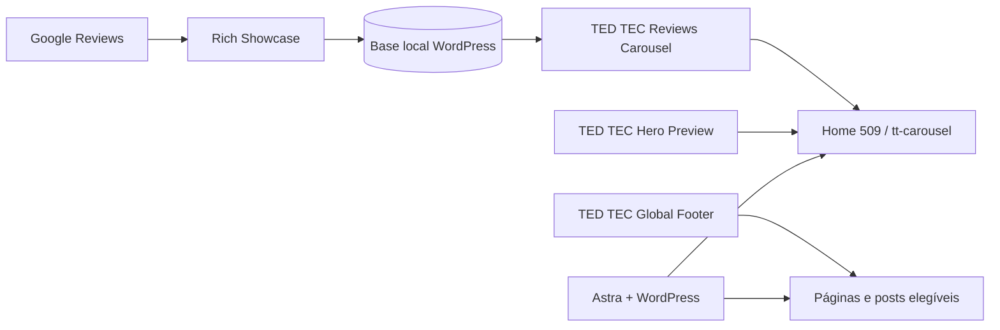

# TED TEC — site WordPress

Código customizado e documentação técnica do site institucional da **TED TEC**, assistência técnica em Brasília. O repositório registra apenas componentes próprios e decisões operacionais; WordPress, tema, mídia, banco de dados e credenciais não são versionados.

Produção: [tedtec.com.br](https://tedtec.com.br/)
Desenvolvimento e direção: [Rê Araujo](https://renatajoin.com)

## Arquitetura



## Componentes versionados

| Componente | Responsabilidade | Versão observada |
| --- | --- | --- |
| TED TEC Reviews Carousel | Adaptar avaliações locais e controlar o `tt-carousel` | 1.1.0 |
| TED TEC Hero Preview | Motion do Hero nas páginas 509 e 1091 | 0.3.2 |
| TED TEC Global Footer | Footer institucional pelo hook oficial do Astra | 1.0.0 |

Dependências externas observadas: WordPress, tema Astra, Rich Showcase for Google Reviews, WP-Cron e LiteSpeed Cache. Nenhuma chave de API ou configuração da hospedagem pertence ao repositório.

## Estrutura

```text
docs/                         documentação técnica e operacional
wordpress/plugins/            plugins próprios prontos para distribuição
wordpress/previews/           notas sanitizadas de homologação
```

Exports de páginas, backups, uploads e pacotes ZIP permanecem fora do Git. O conteúdo editorial canônico continua no banco do WordPress.

## Documentação

- [Arquitetura](docs/architecture.md)
- [Estrutura WordPress](docs/wordpress-structure.md)
- [Fundamentos visuais](docs/ui-foundations.md)
- [Sistema de motion](docs/motion-system.md)
- [Google Reviews](docs/google-reviews-integration.md)
- [Deploy](docs/deployment.md)
- [Rollback](docs/rollback.md)
- [Checklist de QA](docs/qa-checklist.md)
- [Decisões técnicas](docs/decisions.md)
- [Fonte para case de portfólio](docs/portfolio-case-source.md)
- [Inventário de assets](docs/portfolio-assets.md)

## Desenvolvimento seguro

1. Trabalhe em branch de feature a partir de `main`.
2. Não copie `.env`, `wp-config.php`, banco, uploads, logs, cookies, backups ou exports brutos para o Git.
3. Valide PHP, JavaScript, responsividade, reduced motion e fallbacks.
4. Homologue mudanças visuais na página privada 1091 quando aplicável.
5. Faça backup antes de qualquer gravação em produção.
6. Publique apenas os arquivos explicitamente revisados; nunca use inclusão indiscriminada.

Consulte [deployment.md](docs/deployment.md) e [rollback.md](docs/rollback.md) antes de uma entrega.
