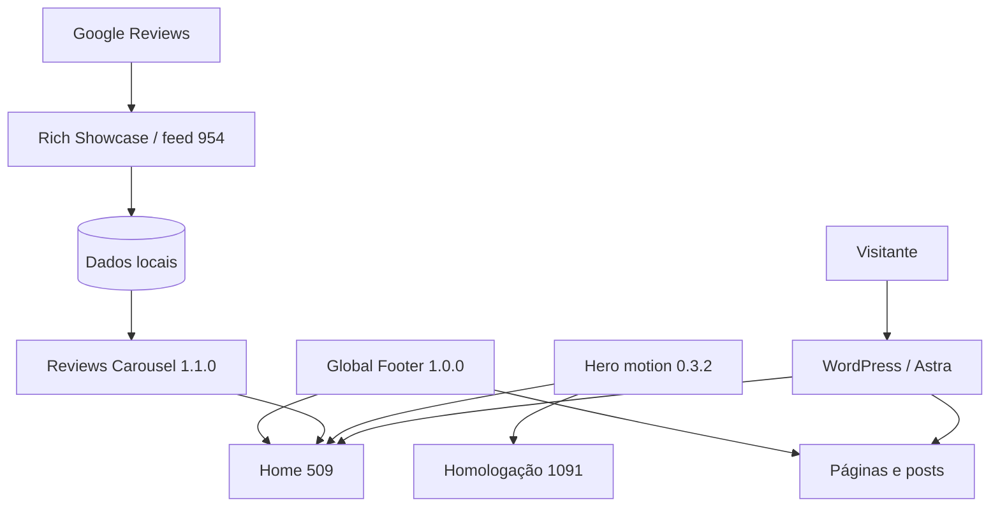

# Arquitetura

## Visão geral

O site mantém WordPress e Astra como plataforma editorial. Recursos que exigem comportamento próprio foram isolados em plugins pequenos, sem transformar o repositório em uma cópia completa da instalação.

## Fronteiras

- WordPress mantém páginas, posts, opções, usuários e mídia.
- Astra fornece estrutura de tema e hooks, inclusive o footer.
- Rich Showcase coleta e armazena avaliações; seu HTML não é usado na Home.
- Os plugins TED TEC leem ou renderizam apenas suas responsabilidades.
- LiteSpeed pode servir cache, mas não é fonte de dados nem mecanismo de sincronização.

## Fluxos críticos

### Avaliações

`Google → Rich Showcase → base local → normalização → shortcode → tt-carousel`

Não existe chamada ao Google durante uma visita. Se a fonte falhar, o adaptador usa o último payload válido e depois uma mensagem estática sem dados pessoais, com acesso ao perfil público.

### Hero

O PHP carrega um controlador JavaScript apenas nas páginas 509 e 1091. O Canvas 2D desenha a visualização técnica; HTML e SVG preservam conteúdo e fallback.

### Footer

O plugin remove o callback do Astra apenas em páginas e posts elegíveis e registra o footer aprovado no mesmo hook. Previews, páginas protegidas e páginas administrativas são excluídos.

## Riscos conhecidos

- A camada PHP consumida do Rich Showcase é interna ao plugin de terceiro e pode mudar.
- Conteúdo da Home continua armazenado no WordPress; o Git não substitui backup de banco.
- O nome “Hero Preview” é legado: o plugin também atende a Home 509.
- Cache pode atrasar a aparência pública após uma gravação, mas não deve ser purgado sem evidência de conteúdo obsoleto.
